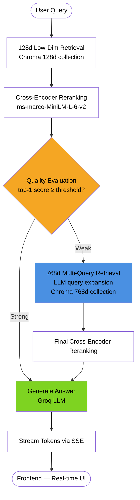

# RAG Search - Adaptive Matryoshka RAG System with Fine-Tuned Embeddings

A Retrieval-Augmented Generation system featuring a fine-tuned embedding model trained on financial data, an adaptive quality-gated retrieval pipeline via LangGraph, and comprehensive observability. Achieves significant performance improvements over base models through Matryoshka representation learning. Trained on a dataset of question-answer pairs from NVIDIA's 10-K document.


## Key ML Features

### Fine-Tuned Embedding Model

- **Base Model**: `nomic-ai/modernbert-embed-base`
- **Fine-Tuned Model (Hugging Face)**: [rya23/modernbert-embed-finance-matryoshka](https://huggingface.co/rya23/modernbert-embed-finance-matryoshka)
- **Training Dataset**: [philschmid/financial-rag-embedding-dataset](https://huggingface.co/datasets/philschmid/finanical-rag-embedding-dataset) (~10k financial Q&A pairs)
- **Architecture**: Matryoshka Representation Learning with Multiple Negatives Ranking Loss
- **Output Dimensions**: [768, 512, 256, 128, 64] - flexible embedding sizes for different use cases

### Performance Improvements

Fine-tuning on domain-specific financial data achieved substantial gains across all metrics:
Base vs Fine-Tuned at 768d Embeddings

| Metric         | Base   | Fine-Tuned | Δ Abs  | Δ %    |
| -------------- | ------ | ---------- | ------ | ------ |
| **NDCG@10**    | 0.7533 | 0.8289     | 0.0756 | 10.04% |
| **MRR@10**     | 0.7164 | 0.7970     | 0.0805 | 11.24% |
| **MAP@100**    | 0.7209 | 0.8001     | 0.0792 | 10.98% |
| **Accuracy@1** | 0.6399 | 0.7247     | 0.0849 | 13.26% |

_Performance varies across embedding dimensions. See [notebook](backend/notebooks/finetuning_embeddding_models.ipynb) for full evaluation._

NDCG@k (Normalized Discounted Cumulative Gain) measures the quality of the top k ranked results by considering both relevance and position. It assigns higher importance to relevant items appearing earlier in the ranking and applies a logarithmic discount to lower-ranked positions

MRR@k (Mean Reciprocal Rank) evaluates how quickly the first relevant result appears within the top k positions. For each query, it computes the reciprocal of the rank of the first relevant item (1 divided by its rank). These values are then averaged across queries. A higher score indicates that relevant results tend to appear earlier in the ranking.

MAP@k (Mean Average Precision at 100) measures ranking precision across the top k results. For each query, it calculates the average precision by computing precision at every position where a relevant item appears and then averaging those values. The final score is the mean across all queries. MAP reflects both ranking order and the ability to retrieve multiple relevant items.

Efficiency Highlight — NDCG@10 Cross-Dimension

| Configuration    | NDCG@10 |
| ---------------- | ------- |
| Base — 768d      | 0.7533  |
| Fine-Tuned — 64d | 0.7831  |

The fine-tuned 64-dimensional model (0.7831) outperforms the base 768-dimensional model (0.7533) by +0.0298 absolute, despite using 12× fewer dimensions.

### Training Configuration

```python
# Matryoshka Loss with MNRL
base_loss = MultipleNegativesRankingLoss(model=model)
train_loss = MatryoshkaLoss(
    model=model,
    loss=base_loss,
    matryoshka_dims=[768, 512, 256, 128, 64]
)

# Training: 4 epochs, global batch size 384
# Optimizer: AdamW with cosine LR scheduler (2e-5)
# Evaluated on NDCG@10 with 128d embeddings
```

### Adaptive Retrieval Pipeline



### Adaptive Matryoshka Retrieval Pipeline (LangGraph)

- **Fast Path (128d)**: Initial retrieval using compact 128-dimensional embeddings for low-latency first-pass search
- **Quality Gate**: Cross-encoder reranker scores `(query, doc)` pairs; if top-1 score ≥ threshold → answer directly
- **Escalation Path (768d)**: Weak retrieval triggers 768d multi-query expansion for maximum recall
- **Dual Cross-Encoder Reranking**: Applied after both fast and escalation paths
- **Conversational Context**: Maintains thread-based conversation history via PostgreSQL checkpointing
- **Streaming Generation**: Real-time token streaming with per-node execution observability

## Monorepo Structure

```
rag-search/
├── backend/              # Python FastAPI + LangGraph
│   ├── api/             # FastAPI server & endpoints
│   ├── cli/             # RAG pipeline & LangGraph logic
│   ├── db/              # Database & vector store
│   ├── observability/   # Trace storage & monitoring
│   └── main.py          # CLI entry point
├── frontend/            # Next.js + React + TypeScript
│   ├── app/            # Next.js 13+ App Router
│   ├── components/     # React components (shadcn/ui)
│   ├── lib/            # API client & utilities
│   └── hooks/          # Custom React hooks (SSE)
└── package.json        # Bun workspace config
```

## System Architecture

### ML Pipeline

1. **Document Ingestion**
    - Semantic chunking with tables pre-processed for financial documents
    - Dual ingestion: embeddings stored in both 128d and 768d ChromaDB collections
    - Embedding generation using fine-tuned ModernBERT with `truncate_dim`

2. **Query Processing — Adaptive Pipeline**
    - 128d embedding for fast first-pass retrieval from the compact collection
    - Cross-encoder reranks candidates; top-1 score gates the routing decision
    - Strong retrieval (score ≥ threshold) → generate answer immediately
    - Weak retrieval → expand with LLM-generated sub-queries, retrieve from 768d collection, rerank again

3. **Retrieval & Generation**
    - Configurable top-k similarity search at each retrieval stage
    - Context-aware generation with conversation history
    - Groq LLM for fast inference

### Observability & Monitoring

- **Trace Storage**: PostgreSQL-backed complete query traces
- **Performance Metrics**: Retrieval time, generation time, total latency
- **Node Execution Tracking**: Full LangGraph pipeline visibility
- **Document Inspector**: Retrieved chunks with similarity scores

### Frontend Interface

- Real-time streaming chat with markdown rendering
- Trace viewer with performance analytics
- Document inspection and metadata display

## Quick Start

### Prerequisites

- **Python 3.13+** with `uv` package manager
- **Bun 1.2+** for frontend
- **PostgreSQL** for trace storage and checkpointing
- **ChromaDB** for vector storage
- **Docker + Docker Compose** (optional, for containerized deployment)

### 1. Install Dependencies

#### Backend

```bash
cd backend
uv sync
```

#### Frontend

```bash
cd frontend
bun install
```

### 2. Configure Environment

Create `.env` in the root directory:

```bash
# Database (PostgreSQL)
user=your_db_user
password=your_db_password
host=localhost
PORT=5432
dbname=your_db_name

# LLM API Keys
GROQ_API_KEY=your_groq_key

# Vector Store
CHROMA_PERSIST_DIRECTORY=./backend/data/chroma
CHROMA_COLLECTION_128D=your_collection_128d
CHROMA_COLLECTION_768D=your_collection_768d

# Reranker
RERANKER_MODEL=cross-encoder/ms-marco-MiniLM-L-6-v2
RERANK_QUALITY_THRESHOLD=0.3
```

Create `frontend/.env.local`:

```bash
NEXT_PUBLIC_API_URL=http://localhost:8000
```

### 3. Start the Application

#### Terminal 1: Backend API

```bash
cd backend
source .venv/bin/activate
python main.py serve --reload
```

Backend will run on `http://localhost:8000`

#### Terminal 2: Frontend

```bash
cd frontend
bun dev
```

Frontend will run on `http://localhost:3000`

### Dockerized Run (Recommended)

This application is fully dockerized with `Dockerfile`s and `docker-compose.yml`.

```bash
docker compose up --build
```

This starts the stack in containers with a single command.

### 4. Ingest Documents (First Time)

```bash
cd backend
source .venv/bin/activate
python main.py ingest path/to/your/document.md
```

## ML Model Training & Evaluation

### Fine-Tuning Your Own Embedding Model

The fine-tuned embedding model is available at [rya23/modernbert-embed-finance-matryoshka](https://huggingface.co/rya23/modernbert-embed-finance-matryoshka). To train your own:

1. **Prepare Your Dataset**

    ```python
    # Dataset format: anchor (query), positive (context), id
    dataset = load_dataset("your-dataset")
    dataset = dataset.rename_column("question", "anchor")
    dataset = dataset.rename_column("context", "positive")
    ```

2. **Configure Training**

    ```bash
    cd backend/notebooks
    # Edit finetuning_embeddding_models.ipynb
    # Adjust: dataset, model_id, matryoshka_dims, training args
    ```

3. **Train & Evaluate**
    - Training uses MultipleNegativesRankingLoss wrapped in MatryoshkaLoss
    - Evaluation is performed across Matryoshka dimensions `[768, 512, 256, 128, 64]`
    - Primary optimization target: `NDCG@10` at `128d`

## Evaluation Metrics

### Information Retrieval Metrics

The system evaluates embedding quality using:

- **NDCG@10** (Normalized Discounted Cumulative Gain): Primary optimization target
- **MRR@10** (Mean Reciprocal Rank): First relevant result position
- **MAP@100** (Mean Average Precision): Overall precision across results
- **Accuracy@k**: Exact match in top-k results
- **Precision@k**: Relevant results ratio in top-k
- **Recall@k**: Coverage of all relevant results

### Comparative Analysis

```python
# From evaluation notebook
metrics = ['ndcg@10', 'mrr@10', 'map@100', 'accuracy@1']
dims = [768, 512, 256, 128, 64]

# Base vs Fine-Tuned comparison shows:
# - Consistent improvements across all dimensions
# - 128d dimension offers best latency/quality tradeoff
# - Minimal quality degradation even at 64d
```

## API Endpoints

### Backend (FastAPI)

- `POST /api/query` - Stream query with SSE

    ```json
    {
        "query": "What was AMD's revenue?",
        "k": 5,
        "thread_id": "optional-uuid"
    }
    ```

- `GET /api/traces?limit=50` - List recent traces
- `GET /api/traces/{trace_id}` - Get trace details
- `GET /api/traces/{trace_id}/docs` - Get retrieved documents

## Technology Stack

### ML & Backend

| Component          | Technology                          |
| ------------------ | ----------------------------------- |
| Embedding Model    | ModernBERT (fine-tuned)             |
| Training Framework | Sentence Transformers               |
| Loss Function      | Matryoshka + MNRL                   |
| Vector Store       | ChromaDB (128d + 768d)              |
| Reranker           | CrossEncoder ms-marco-MiniLM-L-6-v2 |
| LLM                | Groq (Llama 3.1)                    |
| Orchestration      | LangGraph                           |
| API Framework      | FastAPI                             |
| Database           | PostgreSQL                          |

### Frontend

| Layer            | Technology                    |
| ---------------- | ----------------------------- |
| Framework        | Next.js 15 (App Router)       |
| UI Components    | shadcn/ui                     |
| Styling          | Tailwind CSS v4               |
| State Management | TanStack Query                |
| SSE Handling     | Custom hook with native fetch |
| Markdown         | react-markdown                |

## Project Scripts

### Root

```bash
bun dev          # Start frontend dev server
bun build        # Build frontend for production
```

### Backend

```bash
python main.py ingest <file>        # Ingest documents with fine-tuned embeddings
python main.py query                # Interactive query mode
python main.py query --conversation # Conversation mode with context
python main.py serve                # Start API server with streaming
```

### ML Notebooks

```bash
cd backend/notebooks
jupyter notebook finetuning_embeddding_models.ipynb
# - Train custom embedding models
# - Evaluate on your dataset
# - Compare base vs fine-tuned performance
```

### Frontend

```bash
bun dev          # Start dev server
bun build        # Production build
bun start        # Start production server
```

## Architecture

## Production Deployment

### Docker Compose

```bash
docker compose up --build
```

Run this from the repository root to start the dockerized application.

### Backend

```bash
cd backend
uv sync --no-dev
python main.py serve --reload
```

### Frontend

```bash
cd frontend
bun run build
bun start
```

## Performance Considerations

### Embedding Dimension Selection

- **768d**: Highest accuracy, ~2x slower than 128d
- **512d**: Balanced, good for moderate-scale deployments
- **256d**: Fast with minimal accuracy loss
- **128d**: **Recommended** - optimal speed/accuracy tradeoff
- **64d**: Ultra-fast, suitable for initial filtering in cascade retrieval

### Optimization Strategies

1. **Adaptive Cascade**: 128d fast path avoids the expensive 768d retrieval + multi-query expansion for queries where 128d already yields strong results
2. **Single Model, Dual Dimensions**: `truncate_dim` on a single model provides both 128d and 768d embeddings with no extra memory cost
3. **Batch Retrieval**: Process multiple queries in parallel
4. **Caching**: Store embeddings for frequently accessed documents

## References & Resources

- **Notebook**: [Fine-tuning Embedding Models](backend/notebooks/finetuning_embeddding_models.ipynb)
- **Dataset**: [Financial RAG Dataset](https://huggingface.co/datasets/philschmid/finanical-rag-embedding-dataset)
- **Fine-Tuned Model**: [rya23/modernbert-embed-finance-matryoshka](https://huggingface.co/rya23/modernbert-embed-finance-matryoshka)
- **Base Model**: `nomic-ai/modernbert-embed-base`
- **Framework**: [Sentence Transformers](https://www.sbert.net/)
- **Matryoshka Loss**: [Paper](https://arxiv.org/abs/2205.13147)

## Contributing

Contributions welcome! Areas of interest:

- Additional domain-specific fine-tuning datasets
- Alternative embedding architectures
- Improved query routing strategies
- Performance benchmarking tools
